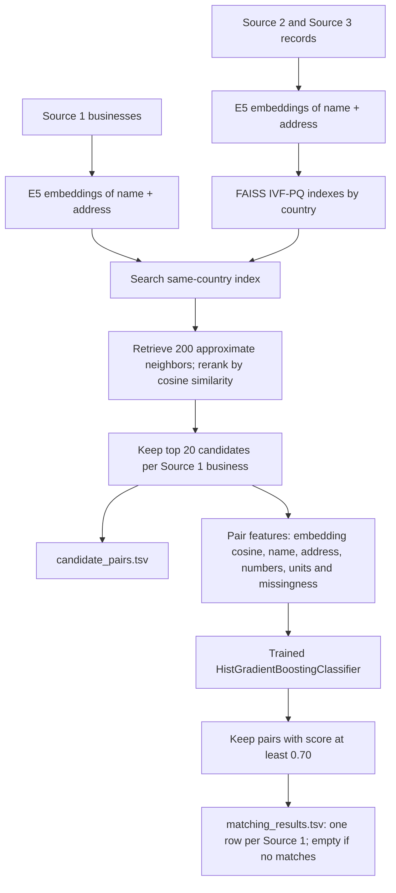

# Voyagers — Business Entity Resolution

Amazon ML Challenge 2026 experiments using business names and addresses across three sources.

## Experiments

| Folder | Purpose |
|---|---|
| `experiments/initial_submission` | Exact-key blocking and initial classifier; reported leaderboard score 0.756 |
| `experiments/embedding_experiment` | Small-pool multilingual embedding pilot |
| `experiments/full_pool_experiment` | Full Source 2/3 embedding pool and matcher training |
| `experiments/embedding_submission` | Country-wise test prediction; selected submission reported leaderboard score 0.84 |
| `experiments/deadline_upgrade` | Larger matcher training and runtime checks |
| `experiments/gap_audit` | Retrieval diagnostics, FAISS parameter ablations, name-only rescue and matcher experiments |

The later experiments were evaluated locally. Their local validation scores are not leaderboard scores, and they are not the selected 0.84 submission.

## High-level architecture

This diagram describes the selected **0.84 leaderboard submission**. The two stages are candidate generation (blocking) and match classification.

**How the matcher learns:** Candidate pairs generated from training records are labeled using the training ground truth. Features from 3,000 Source 1 businesses train the classifier; 500 businesses tune the cutoff and 500 evaluate the pipeline. The E5 encoder remains frozen. At test time, the trained classifier scores candidates without ground-truth labels.

**Why both stages?** Embedding search narrows the large record pool to likely matches. The classifier examines each shortlisted pair in more detail before accepting it. The exported candidate set contains 20 records per business; the intermediate approximate search considers 200 neighbors.

## Workflow

The embedding encoder represents records as vectors. Country-specific FAISS search retrieves a shortlist. A classifier combines embedding cosine similarity with name, address, numeric and missingness features to select final matches.

Open the relevant notebook in Kaggle and attach the original competition dataset. Later diagnostics also require saved outputs from earlier notebooks. Inspect the configuration cell and update input paths before running. These are development notebooks with dependencies on earlier experiments, not one interchangeable pipeline. Notebook outputs have been cleared; code cells are preserved.

The challenge data, predictions, model binaries and search caches are excluded. Keep those privately in saved Kaggle outputs. This repository bundle is separate from the final competition archive, which must contain the exact submitted TSVs and completed organizer documentation.

## Selected submission

The selected 0.84 run uses multilingual E5-small embeddings and a HistGradientBoostingClassifier. Its archived model uses a 0.70 cutoff and 20 candidates per Source 1 record. Later experiments use different settings; do not substitute their model files into the old runner.

The code uses the public `intfloat/multilingual-e5-small` model. Retain applicable upstream license notices when redistributing pretrained weights. Competition datasets are not included.
